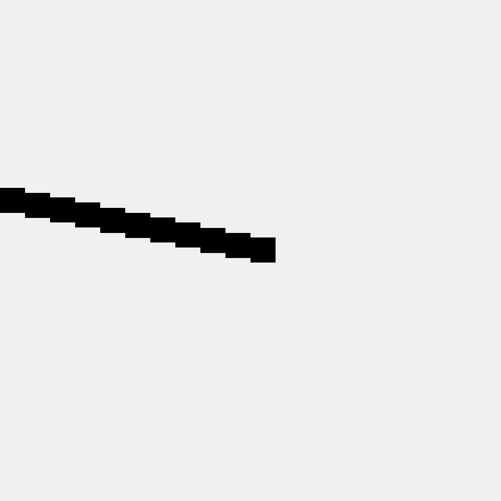

# preview

this is a half baked 'displacement map' attempt... for some reason it's only rendering half the line. It won't render the line when the displacement value is positive (line 56). Not sure why this is the case. 
